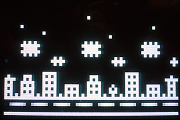

# No shaders
No shaders by Frog //ROi 
256 bytes intro for RCA Studio II computer 

It runs on real hardware (RCA Studio II with any available EEPROM cartridge) or with Emma emulator

If you don't have RCA Studio II, check out Youtube video: https://www.youtube.com/watch?v=Y75XFcLE30Y

License: MIT

